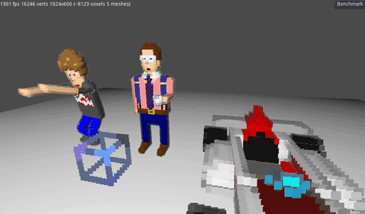

# govox
Godot / vox demo project for voxel importer point_sprite style


# Usage
Check out this repository then run the following:

```
git submodule init
git submodule update --recursive
chmod +x *.sh #maybe not needed on linux
./deploy-git-hooks.sh #deploys a post-checkout hook copying the addon into ./addons, (and runs it once)
```

Open the project in godot

It should look like this: [](https://streamable.com/s/b318z/sxcuia)

# Animating

In order to animate your imported .vox files you need to add bones and weights to all the voxels.

See the C1Rig.tscn scene for an example.

* Create a spatial scene with the BoneRig.gd script on the root spatial.
* Add a MeshInstance with the t-pose .vox file.
* Instance the t-pose .dae file and set the 'editable children' option in the context menu.
* Create an area containing collision shapes which match the bone positions in the voxel model's T pose 
* set the Skeleton Path, Mesh Path, Area Path with names that match the bone names.
* Make sure the .vox resource is not open in the godot inspector! (the bones won't be read from the file if it is)
* Click on the "Collect Bones" checkbox property on the root spatial.
* Collect Bones will save the bones/weights to the .import file for the .vox file...
* Check the Output panel for errors like  no collision for 265 voxels and to make sure all your bones have voxels
* ReImport the .vox file if Auto Reimport is disabled

## Getting Animations

Mixamo animations can be used:

* Export an obj file from MagicaVoxel.
* Run scale_obj.js to scale the obj file up because mixamo will not get the size right...
* Upload to mixamo
* Rig the obj on mixamo and download animations (with skins, probably want to use 'no fingers')
* Download T-pose as Collada (.dae) with skin.
* Download other animations as Collada (.dae) with skin.
* Extract the .dae from  into your projects
* Import the .dae into your scene using 'Instance Child Scene' and then check 'Editable Children' in the context menu on the imported scene node.
    * You can hide or delete the skin from the instanced child scene at this poin
* Then you can set the skeleton nodepath on your MeshInstance to point to the one in the imported '.dae' scene.
